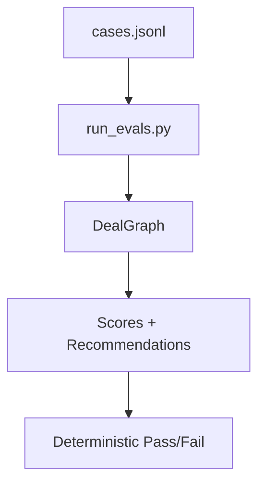

# DealGraph — Deterministic LLM Contract Risk Engine

**DealGraph** is a hybrid **LLM + deterministic control system** for analyzing commercial contracts.  
It produces **auditable risk classifications**, **policy-driven recommendations**, and **confidence-bounded outputs** designed for high-stakes, production environments.

Unlike LLM-only contract analyzers, DealGraph explicitly separates **probabilistic extraction** from **deterministic decision logic**, enabling reproducibility, debuggability, and trust.

---

## Why This Matters

Most LLM-based contract analysis tools fail in predictable ways:

- Non-deterministic outputs
- Hallucinated risks
- No scoring rubric
- No evaluation harness
- Impossible to audit or trust

DealGraph is built around a core production principle:

> **LLMs are probabilistic sensors — not decision-makers.**

They generate structured signals.  
**All final outcomes are governed by explicit, deterministic logic.**

---

## Core Design Principles

### 1. Deterministic Normalization

LLM output is **never trusted directly**.

All extracted risks are re-classified using deterministic rules into:

- **Category** (e.g. Liability, Payment, Service Changes)
- **Severity** (`Low | Medium | High`)
- **Direction** (`Customer-Favorable | Balanced | Customer-Unfavorable`)

This guarantees:

- Stable scoring
- Reproducible outputs
- Auditable logic

---

### 2. Policy-Driven Decisions

Final recommendations are **rule-based**, not model-based.

Examples:
- High customer-unfavorable liability or unilateral amendments ⇒ **REJECT**
- Moderate risk ⇒ **APPROVE_WITH_EDITS**
- Low risk ⇒ **APPROVE**

The LLM **Judge Agent writes rationale only**.  
It does **not** decide outcomes.

---

### 3. Confidence Guardrails

Confidence is bounded by **input quality**, not model confidence.

- Short or partial inputs ⇒ capped confidence
- Missing detail ⇒ explicit fallback behavior
- No false certainty

This prevents a common failure mode in LLM systems: *confident nonsense*.

---

### 4. Evaluation-First Development

Every behavioral guarantee is backed by deterministic evaluation cases.

The system ships with:

- Canonical contract scenarios
- Expected outcomes
- Risk score bounds
- Category coverage assertions

No silent regressions.  
No vibes-based validation.

---

## 🧠 System Architecture

```mermaid
flowchart TD
    A[Raw Deal Text]

    subgraph LLM_Extraction[LLM Extraction Layer]
        B[Clause Agent]
        C[Risk Agent - JSON Output]
    end

    subgraph Deterministic_Core[Deterministic Control Core]
        D[Normalize Node]
        G[Judge Policy Engine]
    end

    subgraph Analysis_Layer[Advisory Analysis]
        E[Precedent Agent]
        F[Negotiation Agent]
    end

    A --> B
    B --> C
    C --> D
    D --> E
    E --> F
    F --> G
    G --> H[Final Decision and Risk Score]
````

Execution is orchestrated using **LangGraph**, with deterministic normalization and evaluation gates to ensure reproducibility.

---

## High-Level Processing Flow

```
Deal Text
   │
   ▼
Clause Agent (LLM)
   │
   ▼
Risk Agent (LLM → structured JSON)
   │
   ▼
Normalize Node (Deterministic)
   │   ├─ category enforcement
   │   ├─ severity rules
   │   ├─ direction rules
   │   └─ risk scoring
   ▼
Precedent Agent (similarity analysis)
   │
   ▼
Negotiation Agent (edit recommendations)
   │
   ▼
Judge Agent (policy verdict + rationale)
   │
   ▼
Final Recommendation
```

---

## 🔍 Evaluation Pipeline



Each evaluation asserts:

* Recommendation correctness
* Risk score bounds
* Required category presence
* Confidence limits

---

## Running the System

### 1. Install Dependencies

```bash
pip install -r requirements.txt
```

### 2. Set Environment Variable

```bash
export OPENAI_API_KEY=your_key_here
```

(or use a `.env` file)

### 3. Run Interactive Analysis

```bash
python main.py
```

Paste a contract, then:

* **Windows:** `Ctrl + Z` → Enter
* **macOS/Linux:** `Ctrl + D`

---

## Running Evaluations

DealGraph includes a full deterministic evaluation harness.

```bash
python -m evals.run_evals
```

Example output:

```
passed=5/5
failed=0/5
```

---

## Example Output

```
RISK SCORE: 16.7

RISK VECTOR:
Termination: Low
Payment: Low
SLA: Low
Liability: Medium
Service Changes: Low

FINAL RECOMMENDATION:
APPROVE

CONFIDENCE:
0.80
```

---

## Why This Is Technically Interesting

This project demonstrates **real-world LLM system design**, not prompt engineering:

* LangGraph orchestration
* LLM output sanitization
* Deterministic overrides
* Scoring calibration
* Policy engines layered on probabilistic models
* Eval-driven development for LLM systems

This is the architecture used in production **legal tech, fintech, and enterprise ML platforms**.

---

## Roadmap (Intentional, Not Hypothetical)

* Weighted category scoring by contract type
* Jurisdiction-specific risk modifiers
* Counterparty-aware normalization
* Dataset-backed precedent embeddings
* Read-only UI demo layer

---

## Disclaimer

This system is for **technical demonstration purposes only**
and does **not** provide legal advice.

---

## Author

Built to demonstrate **production-grade LLM system design**,
not prompt engineering.


