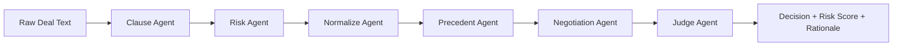
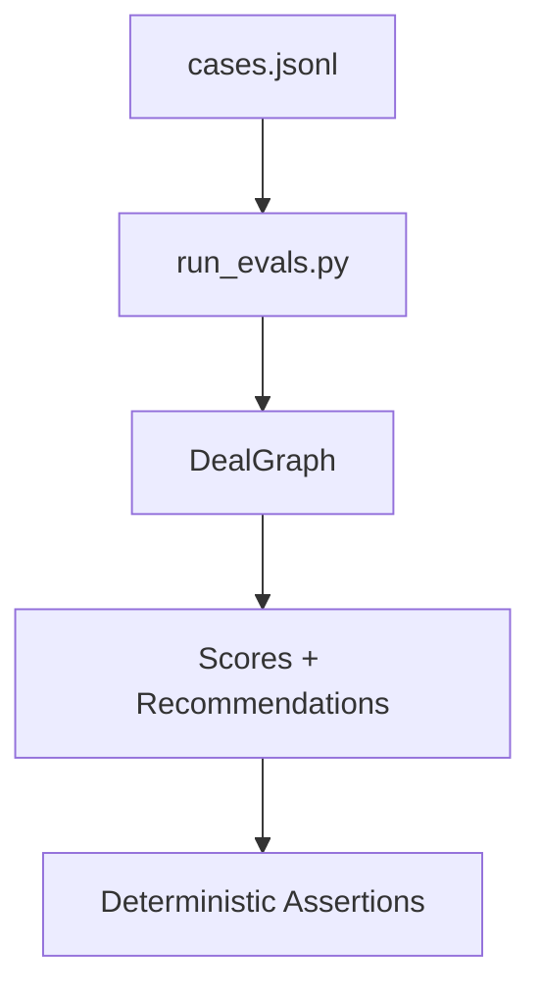

DealGraph — Deterministic LLM Contract Risk Engine

DealGraph is a hybrid LLM + deterministic system for analyzing commercial contracts, producing auditable risk classifications, policy-driven recommendations, and confidence-bounded outputs.

Why this matters
Most LLM contract analyzers hallucinate risks and lack testability.
This system enforces deterministic normalization, policy-gated decisions,
and reproducible evals — the same principles used in production legal AI systems.

Unlike typical “LLM-only” contract analyzers, DealGraph explicitly separates:

Extraction (probabilistic)

Normalization (deterministic)

Decision logic (policy-driven)

Evaluation (testable, repeatable)

This design makes the system reliable, debuggable, and production-grade.

Why This Exists

Most LLM contract tools fail in the same ways:

Non-deterministic outputs

Invented risks

No clear scoring rubric

No evaluation harness

Impossible to audit or trust

DealGraph is built to demonstrate how LLMs should actually be used in high-stakes systems:

as probabilistic sensors feeding deterministic control logic.

## 🧠 System Architecture

Execution is orchestrated via LangGraph with deterministic normalization and evaluation gates to ensure reproducibility.

High-Level Architecture
Deal Text
   │
   ▼
Clause Agent (LLM)
   │
   ▼
Risk Agent (LLM → JSON)
   │
   ▼
Normalize Node (Deterministic)
   │   ├─ category enforcement
   │   ├─ severity rules
   │   ├─ direction rules
   │   └─ score calculation
   ▼
Precedent Agent (LLM similarity)
   │
   ▼
Negotiation Agent (LLM analysis)
   │
   ▼
Judge Agent (Policy + LLM rationale)
   │
   ▼
Final Recommendation

## 🔍 Evaluation Pipeline

Key idea:
LLMs never make final decisions. They generate inputs.
All final outcomes are governed by explicit rules.

Core Design Principles
1. Deterministic Normalization

LLM output is never trusted directly.

All risks are re-classified using deterministic rules:

Category

Severity (Low / Medium / High)

Direction (Customer-Favorable / Balanced / Customer-Unfavorable)

This guarantees:

Stable scoring

Reproducible results

Auditable logic

2. Policy-Driven Decisions

Final recommendations are rule-based, not model-based.

Examples:

High liability or termination risk ⇒ REJECT

Moderate risk ⇒ APPROVE_WITH_EDITS

Low risk ⇒ APPROVE

The LLM Judge writes rationale only, never decisions.

3. Confidence Guardrails

Confidence is bounded by input quality:

Short / vague contracts ⇒ confidence capped

Insufficient detail ⇒ explicit fallback behavior

This prevents false certainty — a common failure mode in LLM systems.

4. Evaluation-First Development

Every behavioral guarantee is backed by eval cases.

The system ships with:

Canonical contract scenarios

Expected outcomes

Risk score bounds

Category coverage assertions

No silent regressions. No vibes.

Running the System
1. Install Dependencies
pip install -r requirements.txt

2. Set Environment Variable
export OPENAI_API_KEY=your_key_here

(or use .env)

3. Run an Interactive Analysis
python main.py

Paste a contract, press Ctrl+Z (Windows) or Ctrl+D (macOS/Linux), then Enter.

Running Evaluations

DealGraph includes a full evaluation harness.

python -m evals.run_evals

Example output:

passed=5/5  failed=0/5

Each eval asserts:

Recommendation correctness

Risk score bounds

Category presence

Confidence limits

Example Output
RISK SCORE: 16.7

RISK VECTOR:
Termination: Low
Payment: Low
SLA: Low
Liability: Medium
Service Changes: Low

FINAL RECOMMENDATION:
APPROVE

CONFIDENCE:
0.80
Why This Is Interesting (Technically)

This project demonstrates:

LangGraph orchestration

LLM output sanitization

Deterministic overrides

Scoring calibration

Policy engines layered on probabilistic models

Eval-driven development for LLM systems

This is exactly the pattern used in real AI infrastructure, legal tech, fintech, and enterprise ML platforms.

Roadmap (Intentional, Not Hypothetical)

Weighted category scoring by contract type

Jurisdiction-specific risk modifiers

Counterparty-aware normalization

Dataset-backed precedent embeddings

UI layer (read-only demo)

Disclaimer

This system is for technical demonstration purposes only and does not provide legal advice.

Author

Built to demonstrate production-grade LLM system design, not prompt engineering.